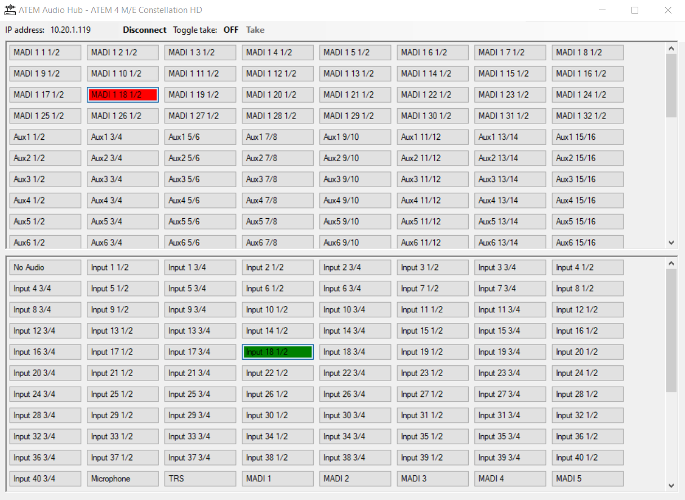

# AudioHub

AudioHub is a Windows Forms application designed to manage and control audio routing for Blackmagic Design's ATEM switchers. The application provides an intuitive interface for configuring audio sources and outputs, making it easy to manage complex audio setups.

## Features

- **Audio Routing Control**: Easily route audio from various sources to different outputs using a simple button interface.
- **Dynamic Button Creation**: Automatically generates buttons for each audio source and output, displaying relevant information such as port types and channel pairs.
- **Tooltips**: Hover over buttons to see detailed information about each audio source and output.
- **Customizable Names**: Rename audio sources directly within the application using a convenient context menu.
- **Visual Feedback**: Buttons change color to indicate the current routing status, providing clear visual feedback.

## Getting Started

To get started with AudioHub, simply run the application and connect it to your ATEM switcher. The application will automatically detect available audio sources and outputs, allowing you to configure your audio routing with ease.

## Requirements

- .NET Framework 4.8
- Blackmagic Design ATEM switcher

## Usage

1. Launch the AudioHub application.
2. Connect to your ATEM switcher.
3. Use the generated buttons to route audio sources to outputs.
4. Right-click on a source button to rename it using the context menu.

## License

This project is licensed under the MIT License.
